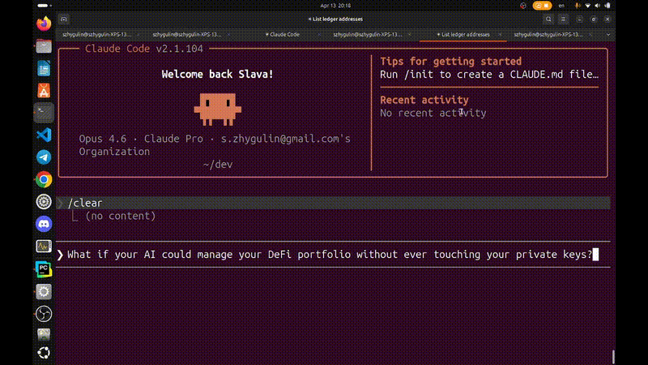

# VaultPilot MCP

[](https://www.npmjs.com/package/vaultpilot-mcp)
[](./LICENSE)
[](package.json)
[](https://glama.ai/mcp/servers/szhygulin/vaultpilot-mcp)

**Safety first. Hardware-verified DeFi for AI agents. The agent proposes, you approve on your Ledger — designed for when the AI can be compromised.**



> **VaultPilot is a self-custodial cryptocurrency MCP server for AI coding agents. Manage portfolios and DeFi positions on Ethereum, Arbitrum, Polygon, Base, Optimism, TRON, Solana, Bitcoin, and Litecoin. Every transaction signs on your Ledger hardware wallet — the AI proposes, you approve. Works with Claude Desktop, Claude Code, Cursor, and any MCP-compatible client.**
>
> Agents: read **[AGENTS.md](./AGENTS.md)** for the agent-targeted install + usage guide. One-line install:
> ```
> curl -fsSL https://github.com/szhygulin/vaultpilot-mcp/releases/latest/download/install.sh | bash
> ```
> (Windows PowerShell: `iwr https://github.com/szhygulin/vaultpilot-mcp/releases/latest/download/install.ps1 -UseBasicParsing | iex`)

VaultPilot MCP is a Model Context Protocol server that lets AI agents — Claude Code, Claude Desktop, Cursor, and any MCP-compatible client — read your on-chain positions across **Ethereum, Arbitrum, Polygon, Base, TRON, and Solana** and prepare transactions you sign on your **Ledger device**. EVM flows go through Ledger Live over WalletConnect; TRON and Solana go through a directly-connected Ledger over USB HID (Ledger Live's WalletConnect bridge does not support either namespace today). Private keys never leave the hardware wallet; every transaction is previewed in human-readable form before you approve it on the device.

Supported protocols: **Aave V3, Compound V3, Morpho Blue, Uniswap V3 LP, Lido, EigenLayer** on EVM, **MarginFi** lending on Solana, plus **LiFi** (EVM swap/bridge) and **Jupiter v6** (Solana swap) aggregation, with **1inch** as an optional EVM quote cross-check.

This is an agent-driven portfolio management tool, not a wallet replacement. The MCP never holds keys or broadcasts anything you haven't approved on your Ledger device.

## Features

- **Portfolio** — cross-chain balances (EVM + TRON + Solana), DeFi position aggregation, USD totals
- **Positions** — Aave, Compound, Morpho, Uniswap V3 LP, MarginFi; health-factor alerts
- **Staking** — Lido + EigenLayer on EVM; TRON Stake 2.0 (freeze/unfreeze/vote/claim); Solana (Marinade / Jito / native stake-account reads, Marinade + native-SOL delegation writes)
- **Swaps** — LiFi on EVM + cross-chain EVM↔Solana (optionally cross-checked against 1inch), Jupiter v6 on Solana
- **Execution** — prepare/sign tx for every supported protocol + native/token sends on EVM, TRON, and Solana. Solana sends are protected by a per-wallet durable-nonce account so Ledger review time doesn't race the blockhash window, and every Solana prepare runs a pre-sign `simulateTransaction` gate so program-level reverts fail loudly at prepare time rather than on broadcast.
- **Security** — contract verification, upgradeability checks, privileged-role enumeration, DefiLlama-backed protocol risk score
- **Utilities** — ENS resolution, token balances, transaction status

## Security model

**VaultPilot assumes the AI agent, MCP server, and host computer can all be compromised. Only your Ledger device is trusted.** Every transaction is cryptographically bound across every layer so that tampering — a swapped recipient, a rewritten swap route, a smuggled approval — produces a visible mismatch on the device screen, giving you the chance to reject before anything is signed.

```
user-intent ──► agent ──► MCP server ──► WalletConnect / USB-HID ──► Ledger Live / host ──► Ledger device
```

Layered defenses catch most single-layer compromises: a server-side prepare↔send fingerprint, an independent 4byte.directory selector check, agent-side ABI decode + pre-sign hash recomputation, on-device clear-sign or blind-sign-hash match, a WalletConnect session-topic cross-check, a `previewToken`/`userDecision` gate, and — for skeptical users on high-value flows — a `get_verification_artifact` that routes bytes to an independent second LLM. **See [SECURITY.md](./SECURITY.md)** for the full defenses table, threat mapping, honest limits, and verification recipes.

### Agent-side hardening (strongly recommended)

The `CHECKS PERFORMED` / `VERIFY-BEFORE-SIGNING` directives VaultPilot emits are authored by the MCP server itself — a compromised server could silently omit them. Install the companion [`vaultpilot-skill`](https://github.com/szhygulin/vaultpilot-skill) so the agent runs the bytes-decode + hash-recompute invariants regardless of what the MCP says:

```bash
git clone https://github.com/szhygulin/vaultpilot-skill.git \
  ~/.claude/skills/vaultpilot-preflight
```

Restart Claude Code after installing. When the skill is missing, the MCP emits a one-shot `VAULTPILOT NOTICE` until you install it. The skill file's expected SHA-256 is pinned in the server source and verified on every signing flow, so on-disk tamper or plugin-collision attempts produce a visible `integrity check FAILED`.

### Conversational `/setup` (optional)

For a chat-driven onboarding flow that detects current config, asks one question to classify the use case, and only collects API keys you actually need, install the companion [`vaultpilot-setup-skill`](https://github.com/szhygulin/vaultpilot-setup-skill):

```bash
git clone https://github.com/szhygulin/vaultpilot-setup-skill.git \
  ~/.claude/skills/vaultpilot-setup
```

Restart Claude Code, then type `/setup` — the agent uses `get_vaultpilot_config_status` (read-only, no secrets leak) to snapshot what's already configured and walks you through whatever's missing. Skip if you'd rather edit the config file directly.

## Supported chains

**EVM**: Ethereum, Arbitrum, Polygon, Base. Lido reads work on both Ethereum and Arbitrum; Lido writes (`prepare_lido_stake` / `_unstake`) are Ethereum-only. EigenLayer is Ethereum-only. Morpho Blue is currently Ethereum-only (Base deployment tracked as a follow-up).

**TRON**: full reads + writes via USB HID (`@ledgerhq/hw-app-trx`). Balance coverage: TRX + canonical TRC-20 stablecoins (USDT, USDC, USDD, TUSD). Staking: Stake 2.0 freeze/unfreeze/withdraw-expire-unfreeze + voting-reward claims. No lending/LP (Aave/Compound/Morpho/Uniswap aren't deployed on TRON). Pair once per session via `pair_ledger_tron`.

**Solana**: SOL + SPL balances; MarginFi lending positions; Marinade / Jito / native stake-account reads (with SOL-equivalent valuation); Jupiter v6 swap quotes. Writes cover SOL / SPL transfers, MarginFi supply / withdraw / borrow / repay, Jupiter-routed swaps, Marinade stake + immediate-unstake, native SOL delegate / deactivate / withdraw, and LiFi-routed EVM↔Solana bridging. Signing via `@ledgerhq/hw-app-solana`. Sends are protected by a per-wallet durable-nonce account (~0.00144 SOL rent, reclaimable) so the ~60s blockhash validity window doesn't expire during Ledger review. One-time setup via `prepare_solana_nonce_init`; teardown via `prepare_solana_nonce_close`. Pair once per session via `pair_ledger_solana`. SOL native transfers clear-sign on device; SPL, MarginFi, and Jupiter flows blind-sign against a Message Hash — enable **Allow blind signing** in the Solana app's on-device Settings.

Ledger Live's WalletConnect bridge does not honor the `tron:` namespace (verified 2026-04-14) or expose Solana accounts (verified 2026-04-23), which is why both paths use USB HID. Readers short-circuit cleanly on chains where a protocol isn't deployed.

## Roadmap

**In flight**

- **Kamino lending** (Solana) — PR #151 landed the `@solana-program/kit` bridge foundation; supply / withdraw / borrow / repay tools follow.

**New protocols (EVM)**

- **Curve + Convex + Pendle + GMX V2** — stable-LP / yield-trading / perps. Direct ABI integration for Curve / Convex / GMX; `@pendle/sdk-v2` for Pendle. ([plan](./claude-work/plan-defi-expansion-roadmap.md))
- **Balancer V2 + V3 + Aura** — Vault-centric LP + V3 Hooks pools + Aura boost. ([plan](./claude-work/plan-balancer-v2-v3-aura.md))
- **DEX liquidity verb set** — Uniswap V3 `mint` / `collect` / `decrease_liquidity` / `burn` / `rebalance` (reads already shipped), Curve LP, Balancer LP. ([plan](./claude-work/plan-dex-liquidity-provision.md))

**New chains**

- **Bitcoin** via Ledger USB HID — native segwit + taproot sends, portfolio integration, mempool.space fee estimation, BIP-125 RBF by default. ([plan](./claude-work/plan-bitcoin-ledger-phase1.md))
- **Hyperliquid L1** — full parity (perps + spot + vaults + staking + TWAP). Ledger-per-trade blind-sign signing; no API-wallet shortcut. ([plan](./claude-work/plan-hyperliquid-full-parity.md))

**More Solana protocols**

- **Drift + Solend lending** — after Kamino lands.
- **Jito liquid-staking writes** — reads ship today; writes blocked on the SDK's ephemeral-signer pattern, raw-ix builder workaround tracked.
- **Multi-tx send pipeline** — unblocks flows that exceed the single-v0-tx size limit (needed for parts of Kamino / Drift).

**New tools**

- **`check_liquidation_risk`** — per-asset "ETH drops X% triggers liquidation" math across Aave V3 / Compound V3 / Morpho Blue. Replaces today's raw-HF-number output with actionable price deltas. ([plan](./claude-work/plan-health-factor-monitoring.md))
- **`get_pnl_summary`** — wallet-level net PnL over preset periods across EVM / TRON / Solana. Balance-delta minus net user contribution, priced via DefiLlama historical. ([plan](./claude-work/plan-pnl-summary-tool.md))

**Wallet integrations**

- **MetaMask Mobile** via WalletConnect v2 — alongside Ledger Live. Reduced final-mile anchor (software wallet) surfaced clearly in docs + pairing receipt. Browser-extension bridge deferred to a follow-up. ([plan](./claude-work/plan-metamask-mobile-walletconnect.md))

**Deployment modes**

- **Hosted MCP endpoint** — OAuth 2.1 + bearer tokens for headless users, operator-supplied API keys, EVM-only for v1. TRON / Solana USB HID tools stay local. ([plan](./claude-work/plan-hosted-mcp-endpoint.md))

**Security hardening**

- **Server-integrated second-agent verification** — MCP calls an independent LLM directly on high-value sends and blocks on disagreement. Structurally closes the coordinated-agent gap that today's copy-paste `get_verification_artifact` flow only narrows.
- **PreToolUse hook for mechanical hash enforcement** — host-side code that recomputes the pre-sign hash and blocks the MCP tool call on divergence, making the check mechanical rather than prose-based. Ships as a separate `vaultpilot-hook` repo.

**Recently shipped** (previously on this list)

- **Nonce-aware dropped-tx polling** (Solana) — on-chain nonce is the authoritative signal for whether a durable-nonce tx can still land; replaces the `lastValidBlockHeight` path that's meaningless for nonce-protected sends (#137).
- **Solana liquid + native staking** — Marinade / Jito / native stake-account reads (#141, portfolio fold-in #143), Marinade writes (#145), native SOL delegate / deactivate / withdraw (#149).
- **LiFi cross-chain EVM ↔ Solana routing** (#153, #155).

## Tools

**Read-only:**

- `get_portfolio_summary` — cross-chain USD totals; optional `tronAddress` / `solanaAddress` fold those chains into the same totals (`breakdown.tron` / `breakdown.solana`)
- `get_lending_positions`, `get_compound_positions`, `get_morpho_positions`, `get_marginfi_positions` — per-protocol lending positions + health factors
- `get_compound_market_info` — wallet-less market snapshot for a single Comet (base-token metadata, supply/borrow/utilization/APR, pause flags, full collateral list with caps + LTV factors)
- `get_market_incident_status` — "is anything on fire" scan across all Compound or Aave markets on a chain; flags paused / frozen / utilization ≥ 95% conditions and surfaces a top-level `incident` bit
- `get_marginfi_diagnostics` — surfaces banks the bundled SDK had to skip, with root cause
- `get_lp_positions` — Uniswap V3 LP + IL estimate
- `get_staking_positions`, `get_staking_rewards`, `estimate_staking_yield` — Lido + EigenLayer
- `get_health_alerts`, `simulate_position_change` — liquidation-risk tooling
- `simulate_transaction` — EVM `eth_call` preview; the Solana equivalent runs automatically inside `preview_solana_send`
- `get_token_balance`, `get_token_price`, `get_token_metadata` — balances + DefiLlama prices (EVM, TRON, Solana); `get_token_metadata` fetches ERC-20 symbol/name/decimals and detects EIP-1967 proxy implementations
- `get_transaction_history` — merged recent-tx reader across external / ERC-20 / internal (and Solana `program_interaction`) with 4byte-decoded methods and historical USD values (Etherscan for EVM, TronGrid for TRON, Solana RPC for Solana)
- `get_tron_staking`, `list_tron_witnesses` — TRON staking state + SR list
- `get_solana_setup_status` — cheap probe of a wallet's Solana setup PDAs (nonce + MarginFi account existence)
- `get_solana_staking_positions` — Marinade mSOL + Jito jitoSOL + native stake-account enumeration with activation status and SOL-equivalent valuation via on-chain exchange rates
- `get_vaultpilot_config_status` — diagnostic snapshot of the local server config (RPC source per chain, API-key presence per service, paired-account counts, WC session-topic suffix, preflight-skill state). Strict no-secrets contract — booleans / counts / source enums / topic suffix only, never values. Use to triage "why isn't my balance read working" before suggesting `vaultpilot-mcp-setup`.
- `get_ledger_device_info` — probe the connected Ledger over USB HID and report which app is currently open (name + version + dashboard flag) plus an actionable hint. Uses the dashboard-level `GET_APP_AND_VERSION` APDU so it works whether the device is on the dashboard or inside any chain app. Returns `deviceConnected: false` cleanly with a hint when no device is plugged in or udev rules are missing on Linux. Call BEFORE `pair_ledger_solana` / `pair_ledger_tron` so you can replace generic "open the Solana app" guidance with a state-aware instruction.
- `resolve_ens_name`, `reverse_resolve_ens` — ENS forward/reverse
- `get_swap_quote` (LiFi, EVM), `get_solana_swap_quote` (Jupiter v6)
- `check_contract_security`, `check_permission_risks`, `get_protocol_risk_score` — risk tooling
- `get_transaction_status` — poll inclusion by hash
- `get_tx_verification` — re-emit the VERIFY-BEFORE-SIGNING block + prepared-tx JSON for a handle when the original prepare_* output has dropped out of context (15-minute TTL); never scrape tool-result files from disk
- `get_verification_artifact` — sparse JSON artifact (calldata / Solana message bytes + hashes) for second-LLM cross-verification; see [SECURITY.md](./SECURITY.md#second-agent-verification-optional-for-the-coordinated-agent-case)

**Execution (Ledger-signed):**

- `pair_ledger_live` (EVM/WalletConnect), `pair_ledger_tron` (USB HID), `pair_ledger_solana` (USB HID), `get_ledger_status` — session + account discovery
- `prepare_aave_*`, `prepare_compound_*`, `prepare_morpho_*` — EVM lending actions
- `prepare_lido_stake` / `_unstake`, `prepare_eigenlayer_deposit` — staking
- `prepare_swap` (LiFi), `prepare_native_send`, `prepare_token_send` — EVM sends + swap
- `prepare_uniswap_swap` — direct Uniswap V3 swap, same-chain only; auto-picks best fee tier across 100/500/3000/10000 bps. Use only when the user explicitly asks for Uniswap; otherwise prefer `prepare_swap` (LiFi) which compares venues
- `prepare_tron_*` — native TRX + TRC-20 transfers, WithdrawBalance claim, Stake 2.0 freeze/unfreeze/withdraw-expire-unfreeze, VoteWitness
- `prepare_solana_nonce_init` / `_close` — one-time setup/teardown of the durable-nonce PDA
- `prepare_solana_native_send`, `prepare_solana_spl_send`, `prepare_solana_swap` — SOL, SPL (auto-includes `createAssociatedTokenAccount` when needed), Jupiter swap
- `prepare_marginfi_init` + `prepare_marginfi_supply` / `_withdraw` / `_borrow` / `_repay` — MarginFi lending
- `prepare_marinade_stake` / `prepare_marinade_unstake_immediate` — Marinade liquid staking: SOL → mSOL deposit, and SOL-pool immediate-unstake (fee applies; unstake-ticket delayed path deferred)
- `prepare_native_stake_delegate` / `_deactivate` / `_withdraw` — native SOL staking: create+delegate a stake account to a validator vote pubkey, deactivate (one-epoch cooldown), drain post-cooldown (full or partial)
- `preview_solana_send` — pins the current nonce/blockhash, serializes the message, computes the Message Hash the user matches on-device, runs the pre-sign simulation gate, emits the CHECKS PERFORMED block. Required between every `prepare_solana_*` and `send_transaction`.
- `send_transaction` — forwards to Ledger: EVM via WalletConnect, TRON/Solana via USB HID

**Meta:**

- `request_capability` — files a GitHub issue for missing protocols/chains/tools. Default returns a pre-filled URL (no auto-submit); rate-limited 3/hour.

## Requirements

- Node.js >= 18.17
- **Zero-config path (portfolio reads):** no API keys needed. The server falls back to PublicNode (EVM) and Solana public mainnet when nothing is configured — rate-limited, but enough for first-contact and light use.
- **For real use:** set your own RPC provider (Infura / Alchemy / custom) for EVM chains and a Solana RPC (Helius / QuickNode / Triton) when the public endpoints rate-limit you. One env var per chain (`ETHEREUM_RPC_URL`, `SOLANA_RPC_URL`, …) or `vaultpilot-mcp-setup`.
- **Optional (prompted on demand):** Etherscan API key, 1inch API key (enables swap-quote comparison), WalletConnect project ID (required for EVM Ledger signing), TronGrid API key (raises the ~15 req/min anonymous cap).
- **For TRON/Solana signing:** USB HID access to a Ledger with the **Tron** / **Solana** app installed. On Linux, install Ledger's [udev rules](https://github.com/LedgerHQ/udev-rules) — `vaultpilot-mcp-setup` prints the exact one-liner if they're missing. `node-hid` compiles natively so Debian/Ubuntu needs `sudo apt install libudev-dev build-essential`. For SPL/MarginFi/Jupiter flows, enable **Allow blind signing** in the Solana app's on-device Settings. SOL native transfers clear-sign and do not need this.

## Install

Three paths — full step-by-step instructions, MCP-client wiring, Gatekeeper / SmartScreen handling, and update / uninstall flows for all three are in **[INSTALL.md](./INSTALL.md)**.

| Path | TL;DR |
|---|---|
| **Bundled binary** (no Node.js needed) | Download the matching pair for your OS from the [latest release page](https://github.com/szhygulin/vaultpilot-mcp/releases/latest), `chmod +x`, run setup. |
| **From npm** | `npm install -g vaultpilot-mcp && vaultpilot-mcp-setup` |
| **From source** | `git clone https://github.com/szhygulin/vaultpilot-mcp.git && cd vaultpilot-mcp && npm install --legacy-peer-deps && npm run build && npm run setup` |

## Setup

Run the interactive setup to pick RPC providers, validate keys, optionally pair Ledger Live, and write `~/.vaultpilot-mcp/config.json`:

```bash
npm run setup
```

Environment variables always override the config file.

## Use with Claude Desktop / Claude Code / Cursor

`vaultpilot-mcp-setup` detects which agent clients you have installed and offers to add a `vaultpilot-mcp` entry to each one's MCP-server config automatically. Each existing config is backed up to `<file>.vaultpilot.bak` before any change. Detected client paths:

- Claude Desktop (macOS): `~/Library/Application Support/Claude/claude_desktop_config.json`
- Claude Desktop (Windows): `%APPDATA%\Claude\claude_desktop_config.json`
- Claude Desktop (Linux): `~/.config/Claude/claude_desktop_config.json`
- Claude Code (user-level): `~/.claude.json`
- Cursor (user-level): `~/.cursor/mcp.json`

Per-project (`<project>/.claude/settings.json`) and per-workspace (`<workspace>/.cursor/mcp.json`) configs are deliberately skipped — the wizard runs from an arbitrary CWD and patching the wrong project is worse than skipping.

If you'd rather edit configs by hand, the entry is:

```json
{
  "mcpServers": {
    "vaultpilot-mcp": {
      "command": "vaultpilot-mcp"
    }
  }
}
```

From source: replace with `"command": "node"` and `"args": ["/absolute/path/to/vaultpilot-mcp/dist/index.js"]`.

## Environment variables

All optional if the matching field is in `~/.vaultpilot-mcp/config.json`; env vars take precedence.

- `ETHEREUM_RPC_URL`, `ARBITRUM_RPC_URL`, `POLYGON_RPC_URL`, `BASE_RPC_URL`, `SOLANA_RPC_URL` — custom RPC endpoints
- `RPC_PROVIDER` (`infura` | `alchemy`) + `RPC_API_KEY` — alternative to custom URLs
- `ETHERSCAN_API_KEY` — contract verification lookups
- `ONEINCH_API_KEY` — enables 1inch quote comparison
- `TRON_API_KEY` — TronGrid (sent as `TRON-PRO-API-KEY`)
- `WALLETCONNECT_PROJECT_ID` — required for Ledger Live signing
- `RPC_BATCH=1` — opt into JSON-RPC batching (off by default; many public endpoints mishandle batched POSTs)
- `VAULTPILOT_ALLOW_INSECURE_RPC=1` — opt out of https/private-IP RPC checks (local anvil/hardhat only)
- `VAULTPILOT_FEEDBACK_ENDPOINT` — optional https proxy for `request_capability` direct POSTs. **The client does not sign or authenticate requests — the proxy MUST enforce its own auth.**
- `VAULTPILOT_SKILL_MARKER_PATH` — suppresses the preflight-skill notice for read-only users who accept the tradeoff

## Development

```bash
npm run dev      # tsc --watch
npm test         # vitest run
npm run test:watch
```

## Contributing

Pull requests are welcome. Before your first contribution, the CLA Assistant bot will ask you to sign the [Contributor License Agreement](./CLA.md) by replying to your PR with a sign-off comment — one signature covers all your future PRs. The CLA grants the project the right to relicense your contribution under future license terms (since the project ships under BUSL-1.1 today and auto-converts to Apache 2.0 in 2030, the relicensing right matters); without it, future license changes get stuck.

The repo owner and Dependabot are exempt from the CLA check.

## License

**Business Source License 1.1** (BUSL-1.1) — see [LICENSE](./LICENSE).

- **Personal self-custodial use is free.** Running `vaultpilot-mcp` on your own machine to manage your own portfolio — including earning yield, swapping, lending, or staking through DeFi protocols on your own behalf — is expressly permitted, even if it generates monetary returns to you.
- **Internal organizational use is free.** Hosting or using the Licensed Work for internal purposes within an organization is not a competitive offering.
- **Hosted services and embedded redistribution require a commercial license.** You may not offer the software (or substantial features of it) to third parties on a paid hosted, managed, or embedded basis without a separate agreement. Open an issue or contact the maintainer for licensing.
- **Auto-converts to Apache 2.0 on 2030-04-26.** Each version's restrictions expire four years after its public release; on the Change Date the license switches to Apache 2.0.
- **Versions ≤ 0.8.2 remain MIT-licensed.** The license change applies to v0.9.0 onward only.
